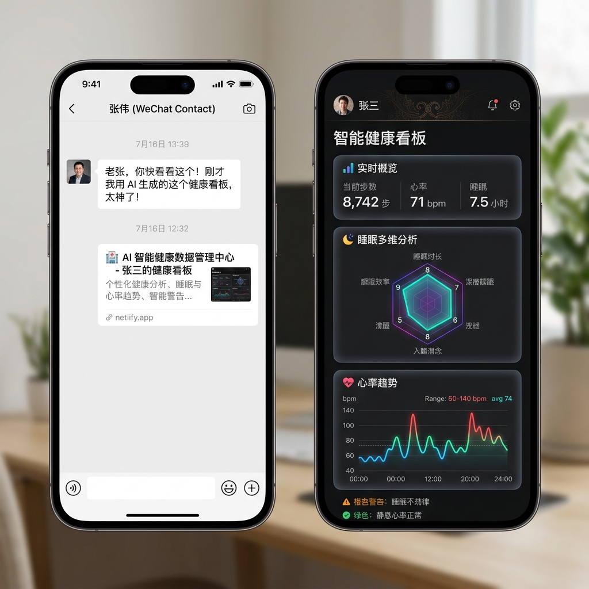

# 🏥 AI 智能健康数据管理中心 (Health Data Manager)

[](https://github.com/yigao714/health-data-manager)
[](CHANGELOG.md)
[](https://www.python.org/)
[](LICENSE)

基于 **Qwen-VL 多模态大模型** 的健康截图结构化 OCR 提取系统与多维度数据分析看板。支持**一键云端部署**与**微信/企业微信端完美共享**，专为家庭多成员长周期健康追踪打造。

> **💡 解决的痛点**：
> 很多长辈使用华为等智能手环/手表，但健康数据零散在“家庭空间”截图里，极难进行长期统计。本项目实现了**“截图发送 → AI 自动提取 → 自动入库归档 → 生成循证医学评估看板 → 一键云部署发回微信”**的闭环。

---

## 🌟 核心功能亮点

### 1. 📸 智能截图识别 (Qwen-VL-max 驱动)
* **秒级提取**：直接拖拽或上传华为/荣耀手机“家庭空间”健康截图，AI 自动提取：**步数、行走距离、锻炼时长、心率范围、静息心率、最低/最高血氧、总睡眠时长、作息起止时间、睡眠分数**，以及 TruSleep 深睡/浅睡/REM/觉醒等睡眠分期数据。
* **AI 双重验证**：大模型提取后，系统会自动将提取结果与原图发给 AI 进行第二轮比对纠错，将大模型“幻觉”率降至最低。
* **同图查重**：同一张截图重复上传会被自动识别跳过，既避免重复计算，也节省 Token。

### 2. 🛡️ 数据质量与完整性保障 (v2.2.0 重点)
医疗健康数据的命脉是**准确**，本版本围绕“**不漏不添、尊重真实数据**”构建了四道把关：

* **🩺 一键数据体检**：随时查看某成员的数据**日期是否连续、每项指标覆盖多少天、有无医学上不可能的值**。某项数据“全无”（如部分手环无血氧监测）会**如实呈现并标注为正常情况，而非错误**——绝不把真实空缺当故障处理。
* **🚧 离谱值硬拦截**：入库前自动拦截医学/物理上不可能的数值（如血氧 > 100%、心率最低值大于最高值），并提示核对截图；**数据缺失（空值）一律放行**，因为空缺是合法的真实情况。
* **🔔 看错位数提醒**：新数据若与该成员历史均值差异过大，自动提醒核对原始截图，并**专项检测 OCR 最危险的“看错位数”错误**（如把 1710 步识别成 17100 步）。
* **📷 截图引用回溯**：完整数据表的每一行都可一键查看**该天数据来源的原始截图**，核对数据准确性时无需再翻找手机相册。

> **字段级智能合并**：同一天若分多张截图上传（如步数一张、睡眠一张），系统会**累积补全、互不覆盖**；重新上传某天截图则可修正错误值——既不丢数据，也支持纠错。

### 3. 📊 可视化多维健康看板 (ECharts)
* **多维动态图表**：自动绘制活动量、心脏波动、血氧变化、睡眠规律性等多维动态折线图、柱状图、雷达评分图及日历热力图，支持 7天/30天/90天/全部 时间窗口切换。
* **个体化循证阈值**：引入专业医学背景的指标校正：
  * **呼吸系统疾病 (COPD/慢阻肺)**：自动下调血氧安全阈值，避免误报。
  * **年龄校正**：根据长辈年龄（如 $\ge 65$ 岁）动态适配睡眠时长与心率评估基准。
  * **药物 (β阻滞剂)**：自动调整静息心率评估区间。
* **循证风险评估**：综合健康评分、每日风险标记、多维交叉预警（睡眠-心率、运动-深睡、久坐风险等）、OSAHS 氧减指数 (ODI) 筛查与作息规律性 (SRI) 分析。

### 4. 📦 多数据入口、导出与编辑
* **截图 OCR**（主入口）：适合日常逐日记录。
* **华为运动健康压缩包导入**：上传从华为「个人数据与隐私」导出的 `.zip` 备份（**加密或未加密均可**——加密包填邮件密码，未加密则留空），系统在内存中流式解密（数据不落地），批量提取并**字段级合并**步数、心率、血氧、睡眠等历史数据。
* **外部 CSV 导入**：上传其他设备/App 导出的健康 `.csv`（自动探测 UTF-8 / GBK 编码），按**列名语义识别**字段（不依赖列顺序，未来列更多也兼容），自动拆分"心率区间"为最低/最高、统一多种日期格式；识别不出的列会如实列出供核对，绝不乱填或丢弃。
* **📑 一键导出 CSV**：数据管理页可将某成员识别到的全部健康数据导出为 CSV 文件保存。导出**全部指标字段**（含睡眠分期、压力、呼吸、来源截图），空缺字段如实留空（不漏不添），UTF-8 BOM 编码，Excel 双击直接正确显示中文。
* **✏️ 数据表内联编辑**：核对发现错值时，可在数据管理表直接逐行编辑修正（步数/距离/心率/血氧/睡眠等），只改改动的字段、未展示字段原样保留；保存前走医学硬拦截，挡下不可能值。

### 5. 📤 一键发布云端 & 手机微信完美适配
* 解决手机微信直接发送 `.html` 文件在苹果手机上显示源码、在华为手机上图表空白的痛点。
* 支持一键调用 Netlify 免费云托管 API，生成专属、高私密性的随机域名网址。
* 接收人直接在微信中点击链接即可在内置浏览器内完美运行全交互动态图表（支持 ECharts 动效、多时间窗口切换与置灰防呆逻辑）。



---

## 🏗️ 架构与技术栈

### ⚙️ 系统工作流与架构 (Mermaid)

```mermaid
graph TD
    A[智能健康设备/手环] -->|健康数据截图| B[微信家庭空间/截图]
    B -->|拖入/上传| C[AI 智能健康数据管理中心]

    subgraph 后端服务 (Python Flask)
        C -->|1. OCR 结构化提取| D[通义千问 Qwen-VL-max]
        D -->|提取数据| E[AI 双重验证与纠错]
        E -->|清洗校验 + 离谱值拦截 (Pydantic)| F[字段级增量合并 & 入库]
        F -->|数据更新| G[生成内联 HTML 仪表盘]
        F -->|报告导出| H[Word 阶段性分析报告]
    end

    subgraph 前端展示 & 云端共享
        G -->|一键发布 API| I[Netlify 云端托管]
        I -->|专属随机加密 URL| J[微信/企业微信端完美共享]
        G -->|局域网共享| K[家庭 WiFi 终端访问]
    end

    style C fill:#f9f,stroke:#333,stroke-width:2px
    style I fill:#bbf,stroke:#333,stroke-width:2px
    style J fill:#bfb,stroke:#333,stroke-width:2px
```

* **后端服务**：Python + Flask (轻量高效)
* **大模型驱动**：阿里云通义千问 Qwen-VL-max API (零额外本地硬件要求)
* **前端渲染**：Vanilla HTML5 + Modern CSS3 + Javascript (ES6)
* **数据可视化**：Apache ECharts (完全内联化处理，支持完全脱网离线查看)
* **报告导出**：python-docx 自动渲染带表格、图表和医学建议的 Word 版阶段性分析报告

---

## 🚀 快速启动指南

### 1. 安装依赖环境
请确保您的电脑上已安装 Python 3.9 或更高版本，然后在项目目录下运行以下命令：
```bash
pip install flask python-docx matplotlib pydantic pydantic-settings requests pyzipper
```
> `pyzipper` 仅用于华为加密压缩包导入功能；若只用截图识别可不安装。

### 2. 配置大模型 API 密钥
本系统使用通义千问大模型进行截图 OCR，请在您的系统环境变量中配置您的 DashScope 密钥（[如何获取 API 密钥](https://help.aliyun.com/zh/dashscope/developer-reference/acquisition-and-configuration-of-api-key)）：
* **Windows (PowerShell)**:
  ```powershell
  $env:DASHSCOPE_API_KEY="您的阿里云API密钥"
  ```

### 3. 启动项目
双击运行目录下的 [`start.bat`](start.bat)，或者在命令行中运行：
```bash
python app.py
```
启动后，系统会自动在您的默认浏览器中打开管理中心：
👉 `http://localhost:8080`

---

## 🔒 隐私保护策略 (Safety & Privacy First)

本项目对隐私保护极度重视，在开源设计中采用了多层防御：
1. **数据本地化**：所有成员的健康记录、个人档案以及上传的截图全部物理保存在您本地电脑的 `people/` 目录中。
2. **Git 强隔离**：项目内置了高强度的 [`.gitignore`](.gitignore) 配置文件。您上传到 GitHub 上的版本**绝对不会包含任何家人姓名、截图、本地健康数据库、API 密钥或 Netlify 令牌**。
3. **云端安全网址**：发布到 Netlify 的网址包含 8 位以上随机加密后缀，且禁止搜索引擎抓取，只有拿到您分享的专属链接的人才可访问。
4. **解密不落地**：华为加密压缩包在内存中流式解密，密码与明文数据均不写入硬盘。

---

## 🤝 贡献与 Star

如果您觉得这个工具对您照顾家人、记录长辈健康有所帮助，欢迎在右上角点一个 **⭐ Star**！

您的点赞是这个项目持续迭代的动力！有任何功能建议或 Bug 反馈，请在 Issue 区提出。

### 📌 参与贡献

- 📖 阅读 [**贡献指南 (CONTRIBUTING.md)**](CONTRIBUTING.md) 了解开发规范与 PR 流程
- 🗺️ 查看 [**功能路线图 (FEATURE_ROADMAP.md)**](FEATURE_ROADMAP.md) 了解未来方向和可认领任务
- 📋 查看 [**更新日志 (CHANGELOG.md)**](CHANGELOG.md) 了解各版本迭代详情
- 🏷️ 新手推荐从标记有 `good first issue` 的 Issue 开始

---

> ⚕️ **免责声明**：本项目提供的所有评估、评分与预警均基于公开循证医学指南的通用规则，由腕式可穿戴设备数据计算得出，**仅供家庭健康趋势参考，不构成任何医学诊断意见**。任何健康决策请遵循执业医师的专业判断。
